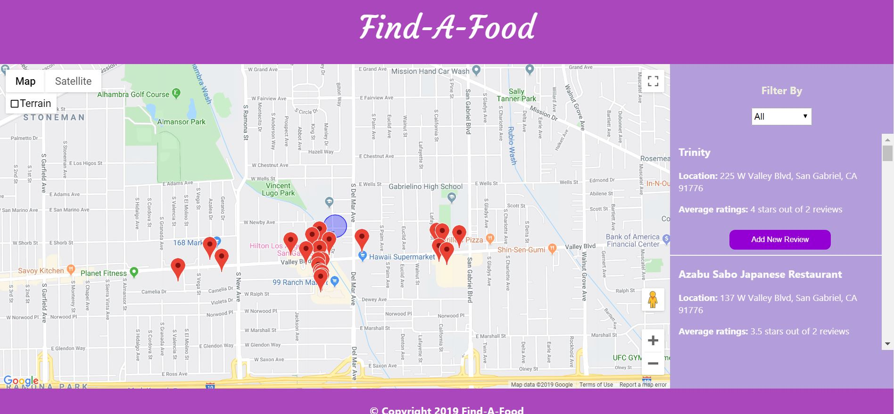
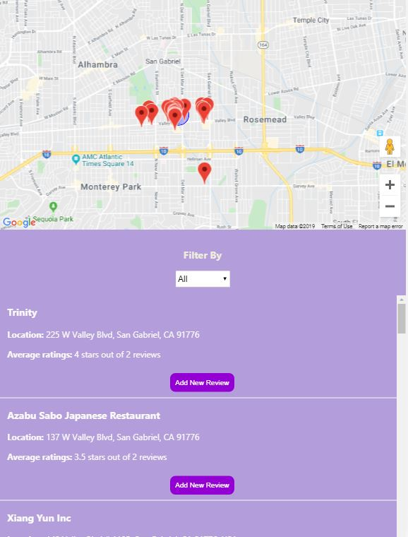

# Find-A-Food

## Desktop Version
  

## Mobile Version

## Purpose of the Project

There will be 2 main sections:  

A Google Maps map will created using the the Google Maps API will located on the left for larger screen sizes 
and for smaller screen sizes, it will located on the top.  

There will be a list of restaurants will be located right side on for larger screen sizes  
and for smaller screen size, it will located below the map.  

## Features of the Project

The Google Maps map will focus immediately on the position of the user.  
A specific color marker should be shown at the user's current location.  

Data will be drawn from the Google Places API  

Restaurants will be displayed on the map according to their GPS coordinates.  
Restaurants that are currently visible on the map should be displayed in list form on the side of the map as mentioned above.  
You will see the average reviews of each restaurant (ranging from 1 to 5 stars).  

Clicking on a restaurant will provide a list of reviews and comments as well as the corresponding picture of the restaurant (if it is available) using the Google Street View API.  

A filter tool allows the display of restaurants that have between 0 and 5 stars and vice versa.   
The map will display accurately to the corresponding restaurants.  

Once a review or restaurant has been added, it should appear immediately on the map. A new marker will show the position of the new restaurant.  

The information will only be saved for the duration of the visit  